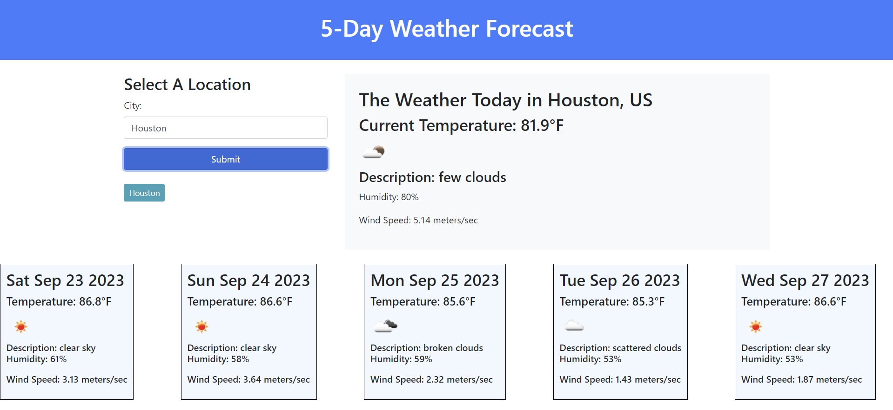

# 5-Day Weather Forecast

## Desription

This webpage's purpose is to display current weather data for a given city, as well as forecast weather conditions for the next 5 days. The information for weather that is presented to the user is: city name, date of weather information, current temperature (in fahrenheit), weather desription & an icon reflective of that description, humidity %, and wind speed (meters/second). When user loads the page they will see an input container to type the city name they'd like to search. WHen they click the submit button, not only are the weather results displayed, but there is a button formed underneath input container with the searched city's, allowing for research of weather when user clicks on the button. 

This webpage opened up a lot of new things for me, and also helped in deepending understanding of JavaScripting. I chose to use this challenge to get more hands on experience using CSS Frameworks, and styled the page using Bootstrap. After completing this module, I feel I am much more comfortable in review&comprehension of API documentation, how to fetch, the use of asynch functions, and preparing for unexpected network repsonse. As an added API, I chose to use a Google font on the entire webpage. 

## Installation

No installation is required by the user to interact with this application.

## Usage

As a user of this site, I am curious about the weather conditions today, and through the following 5 days for a vareity of cities. I want to be able to type the city I'd like to search, be given the weather informaiton for that city, and have my search added to a history so I can re-search that same location again if needed. When I load this page I am able to type my city and click 'submit'. WHen I do this click, I receive weather information for the city, if the city is found by the API, and my search appears as a button where I can click to search again. 

### Static Page View

### Interactive Page View

### Link to Deployed Page

[5-day Weather Forecast](https://mmw18.github.io/5day-weather-forecast/)